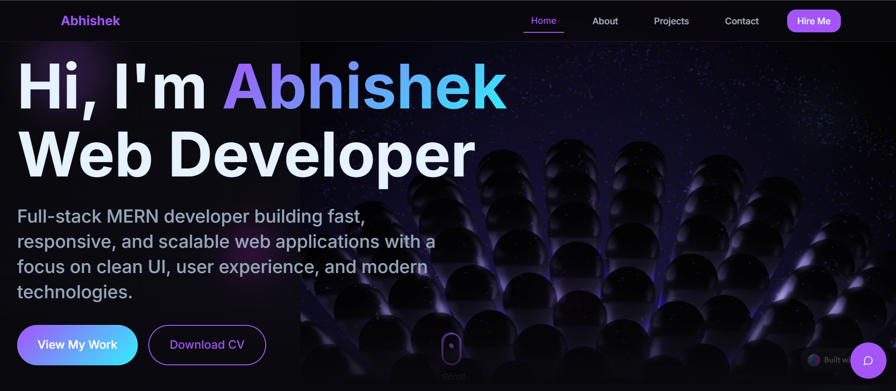
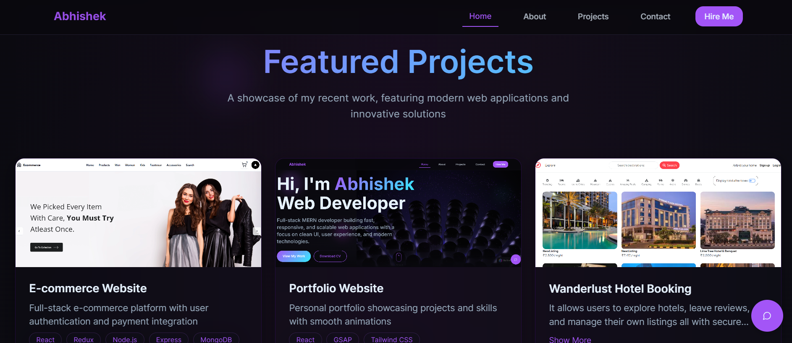

# 🧑‍💻 Portfolio

A beautifully crafted, fast, and fully responsive **portfolio** built with **TypeScript**, **React**, and **Vite**. Showcases projects, skills, and personal branding, with **custom chat**, **EmailJS integration**, and **shadcn/ui** components styled using **Tailwind CSS**.

## 🌐 Live Demo

🔗 [View Portfolio](https://portfolio-nu-plum-p1nqde4esj.vercel.app/)

## 🚀 Tech Stack

| Area          | Technologies                                              |
| ------------- | --------------------------------------------------------- |
| Frontend      | Vite, TypeScript, React, Tailwind CSS, shadcn/ui          |
| UI Components | Radix UI (modals, tooltips, etc.), Lucide, Phosphor Icons |
| Forms         | React Hook Form, Zod, @hookform/resolvers                 |
| Animations    | Framer Motion, GSAP, Locomotive Scroll                    |
| Communication | EmailJS (email sending), Custom Chat Interface            |
| Routing       | React Router DOM, Hash Links                              |
| Utilities     | React Query, clsx, date-fns, Tailwind Merge, Recharts     |

## 🧩 Features

### 🖥️ Portfolio Sections

* 🏠 Hero section with name, role, and call-to-actions
* 💼 Projects grid with live preview + GitHub links
* 🛠️ Skills & Tech Stack overview
* 📃 Resume section or downloadable CV
* 🙋 About Me page
* 📩 Contact form (powered by EmailJS)

### 💬 Interactivity

* 📧 Send messages without page reload (EmailJS)
* 💬 Custom chat integration for real-time engagement
* 🌗 Light/Dark mode support (via `next-themes`)
* 🔍 Smooth scrolling with **Locomotive Scroll**
* 📈 Analytics-ready with charts (Recharts integration)

### 🎨 UI/UX

* ⚡ Fast performance with Vite
* 🧠 Accessible UI components using shadcn/ui and Radix
* 📱 Fully responsive and mobile-optimized
* ✨ Subtle animations powered by Framer Motion and GSAP

---

## 📸 Screenshots

| Home                            | Projects                                |
| ------------------------------- | --------------------------------------- |
|  |  |

---

## 📦 Installation

1. **Clone the repository**

```bash
git clone https://github.com/abhishekkr8/Portfolio.git
cd Portfolio
```

2. **Install dependencies**

```bash
npm install
```

3. **Set up environment variables**

If using EmailJS or other services, create a `.env` file:

```env
VITE_EMAILJS_SERVICE_ID=your_service_id
VITE_EMAILJS_TEMPLATE_ID=your_template_id
VITE_EMAILJS_PUBLIC_KEY=your_public_key
```

4. **Run the development server**

```bash
npm run dev
```

5. **Build for production**

```bash
npm run build
```

---

## 📫 Contact

* 📧 Email: [your.email@example.com](mailto:abhishekkr8709@gmail.com)
* 🔗 LinkedIn: [linkedin.com/in/yourname](https://linkedin.com/in/abhishekkr8709)
* 🐙 GitHub: [github.com/yourusername](https://github.com/abhishekkr8)

---

## 🤝 Contributing

```bash
# Fork the repo
# Create a new feature branch
git checkout -b feature/AmazingFeature

# Make changes and commit
git commit -m "Add AmazingFeature"

# Push and open PR
git push origin feature/AmazingFeature
```

